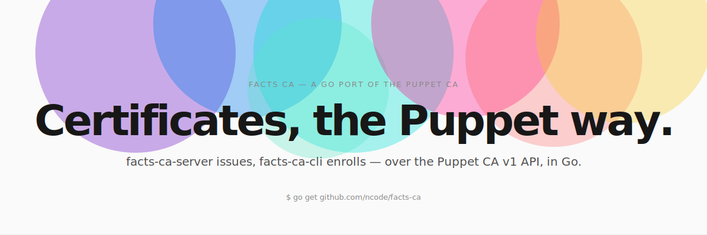

# facts-ca — a Go port of the Puppet CA

<picture>
  <source media="(prefers-color-scheme: dark)" srcset="docs/assets/hero-dark.svg">
  
</picture>

<p align="center">
  <a href="https://github.com/ncode/facts-ca/actions/workflows/unit_tests.yaml"></a>
  <a href="https://github.com/ncode/facts-ca/actions/workflows/checks.yaml"></a>
  <a href="https://goreportcard.com/report/github.com/ncode/facts-ca"></a>
  <a href="https://codecov.io/gh/ncode/facts-ca"></a>
  <a href="https://pkg.go.dev/github.com/ncode/facts-ca"></a>
  
  <a href="https://opensource.org/licenses/Apache-2.0"></a>
</p>

`facts-ca-server` and `facts-ca-cli` speak the **Puppet CA v1 HTTP API**
(`/puppet-ca/v1/...`) over mTLS. A fresh `facts-ca-cli` bootstraps exactly like a
Puppet agent — trust-on-first-use of the CA cert, generate key + CSR, submit,
poll until signed — and stores everything in a Puppet-compatible `ssldir`. The
server stores state in a puppetserver-style `cadir`.

## Use as a library

facts-ca is also a toolkit: the reusable halves are importable, so another
service can get a CA-signed mTLS identity, or embed a Puppet-compatible CA, in a
few lines. The `agent` and `ca` facades and the `pki` X.509 primitives are
public; the wire plumbing stays `internal/`.

```go
// Inbound + outbound mTLS for a service, zero Puppet knowledge:
id, err := agent.Enroll(ctx, agent.Config{
    Server:        "ca.internal:8140",
    Certname:      "payments-api.prod",
    CAFingerprint: pinned, // pin the CA (or TrustOnFirstUse for a lab)
})
srv := &http.Server{Addr: ":8443", TLSConfig: id.ServerTLSConfig(), Handler: mux}
out := id.HTTPClient() // calls to mesh peers are mutually authenticated

// Embed a Puppet-compatible CA beside your own routes:
c, err := ca.Open(ca.Options{Dir: "/var/lib/myca"})
mux.Handle("/puppet-ca/v1/", c.Handler())
```

`agent.Config.Dir` is optional — a Puppet `ssldir` on disk when set, ephemeral
in-memory when empty. Trust is explicit (pin via `CACert`/`CAFingerprint`, or
opt into `TrustOnFirstUse`); the library never prints and never trusts a fetched
CA silently. The TLS configs read the live cert through `Get(Client)Certificate`
callbacks, so a future renewer can rotate it in place. The API is pre-1.0 (v0.x)
and may still change.

## Build

```
go build ./cmd/facts-ca-server
go build ./cmd/facts-ca-cli
```

## Server

```
# create the CA and serve (autosign for a lab)
facts-ca-server -init -cadir ./cadir -hostname ca.example.com -autosign

# policy-gated autosign
facts-ca-server -init -cadir ./cadir -hostname ca.example.com -autosign \
    -autosign-policy-executable /usr/local/bin/facts-ca-autosign

# production-style: no autosign, sign requests by hand
facts-ca-server -init -cadir ./cadir -hostname ca.example.com
facts-ca-server list                 # show pending/signed
facts-ca-server sign   agent.fqdn    # == puppetserver ca sign
facts-ca-server revoke agent.fqdn
facts-ca-server clean  agent.fqdn
```

Flags: `-listen` (default `:8140`), `-ttl` (issued-cert lifetime, default 5y),
`-ca-name`, `-autosign`, `-autosign-policy-executable`,
`-autosign-policy-timeout` (default 5s when a policy is configured),
`-allow-dns-alt-names` (honor SANs in agent CSRs; default off, matching
puppetserver's `allow-subject-alt-names`).

`cadir/` layout: `ca_crt.pem ca_key.pem ca_pub.pem ca_crl.pem serial
inventory.txt signed/ requests/` — plus `server_crt.pem`/`server_key.pem` for
the listener's own TLS identity.

## Agent (CLI)

```
# bootstrap this host's cert
facts-ca-cli bootstrap --server ca.example.com:8140 --certname agent.fqdn \
    --ssldir ./ssl [--waitforcert 2m] [--onetime] [--dns-alt-names a,b]

# use the issued cert for an mTLS request
facts-ca-cli mtls --server ca.example.com:8140 --ssldir ./ssl \
    --url https://service/path

# drive the CA admin API over mTLS (needs an issued cert)
facts-ca-cli ca list
facts-ca-cli ca sign   other.fqdn
facts-ca-cli ca revoke other.fqdn
```

`ssldir/` layout matches Puppet: `private_keys/<certname>.pem
public_keys/<certname>.pem certs/<certname>.pem certs/ca.pem
certificate_requests/<certname>.pem crl.pem`.

`--certname` defaults to the host FQDN on bootstrap; `mtls`/`ca` auto-discover
the bootstrapped identity in the ssldir.

## Extended attributes (trusted facts)

Puppet's `csr_attributes.yaml` `extension_requests` — the trusted-fact OIDs in
the `1.3.6.1.4.1.34380.1.*` arc — are supported on both sides: the CLI embeds
them in the CSR, and the CA copies the allowed ones into the issued cert (and
surfaces the auth subtree as `authorization_extensions` in `certificate_status`).

```
# repeatable --ext, by Puppet short name or raw OID
facts-ca-cli bootstrap --server ca:8140 \
    --ext pp_role=web --ext pp_uuid=ED803750-... --ext 1.3.6.1.4.1.34380.1.2.1=custom

# or a Puppet csr_attributes.yaml
facts-ca-cli bootstrap --server ca:8140 --csr-attributes examples/csr_attributes.yaml
```

Short names: `pp_uuid pp_instance_id pp_image_name pp_preshared_key
pp_cost_center pp_product pp_project pp_application pp_service pp_employee
pp_created_by pp_environment pp_role pp_software_version pp_department pp_cluster
pp_provisioner pp_region pp_datacenter pp_zone pp_network pp_securitypolicy
pp_cloudplatform pp_apptier pp_hostname pp_authorization pp_auth_role`. Any OID
under the Puppet arc (registered `.1.1.*`, private `.1.2.*`, auth `.1.3.*`) is
accepted; the CA drops anything outside it, as puppetserver does. Values are
DER `UTF8String`, matching Puppet.

## Interop with a real puppetserver

`docker-compose.yml` runs an actual `puppet/puppetserver` CA; `./interop.sh`
builds the CLI, waits for it, and bootstraps `interop-node.test` against the
real CA *with* trusted-fact extensions, then asserts puppetserver copied them
and that the issued cert works for mTLS back to puppetserver.

```
./interop.sh                 # deploy + run the interop checks
docker compose down -v       # tear down
```

(puppetserver is amd64-only; the compose file pins `platform: linux/amd64` so it
runs under emulation on Apple Silicon — first boot is slow.)

## Compatibility

Implements the documented Puppet CA v1 endpoints — `certificate/:name`
(incl. `ca`), `certificate_request/:name` (PUT/GET/DELETE),
`certificate_revocation_list/ca`, and the admin `certificate_status[es]`
(PUT `{"desired_state":"signed"|"revoked"}`). PEM is served as `text/plain`;
keys are RSA-4096/SHA-256 by default (`keylength`), certs default to a 5-year
`ca_ttl`.

Verified end-to-end by `./e2e.sh` (server + CLI over the wire) and
`go test ./...`. Interop against a live puppetserver/agent is the remaining
validation step and is not exercised here.

## Known simplifications

- `custom_attributes` (e.g. `challengePassword`) in `csr_attributes.yaml` are
  parsed but not embedded — Go's CSR API has no clean path for arbitrary CSR
  attributes. `extension_requests` (the cert-bearing trusted facts) are fully
  supported.
- `autosign.conf` glob lists are not implemented. Under blanket `-autosign`
  without `-autosign-policy-executable`, a node can self-assert any trusted-fact
  extension (including the auth subtree `pp_authorization`/`pp_auth_role`),
  exactly as puppetserver copies them — so don't base authorization on
  self-asserted facts unless you gate signing (manual sign or an autosign
  policy).
- The `serial` file is not locked across processes — run offline `sign` while
  the server is stopped, or rely on the in-process admin API.
- Admin API authorization is "any CA-signed client cert", not Puppet `auth.conf`
  rules.
